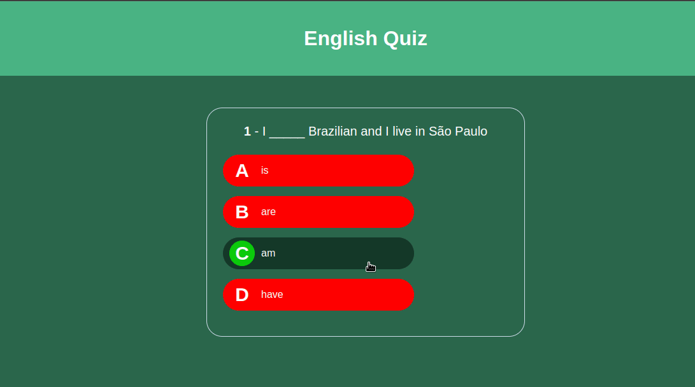

    

 
 <h1>English Quiz </h1>
 
Este projeto realizado durante o curso de JavaScript da plataforma Udemy, sobre a orientação do professor <a href="https://www.udemy.com/user/matheus-battisti/">Matheus Battisti</a>, foi desenvolvido em HTML5, CSS3 e Javascript, neste projeto foi possivel trabalhar com objetos, praticar a responsividade,e a realizar a manipulação do DOM.

 

     
 

 

    Confira <a href="https://mendjoy.github.io/EnglishQuiz/">aqui</a>

 